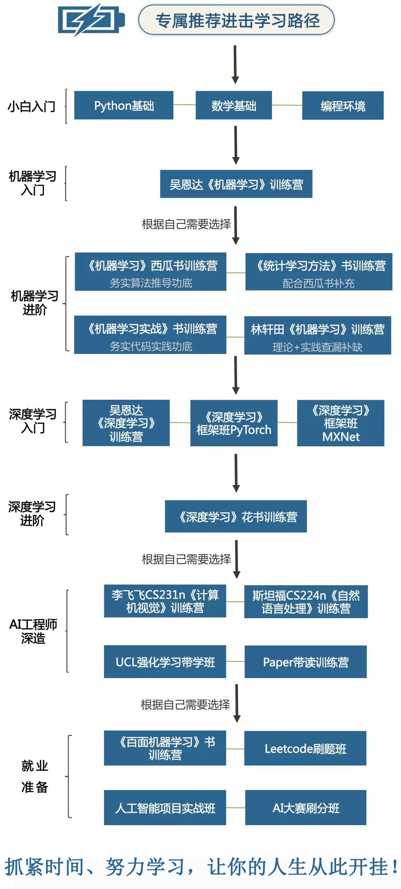
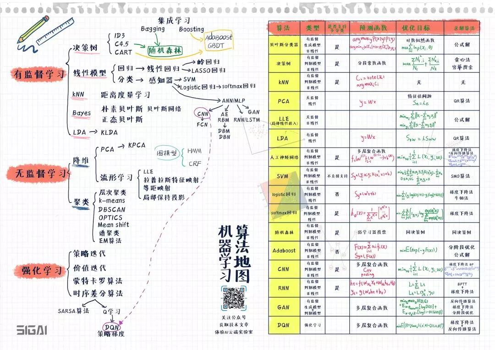
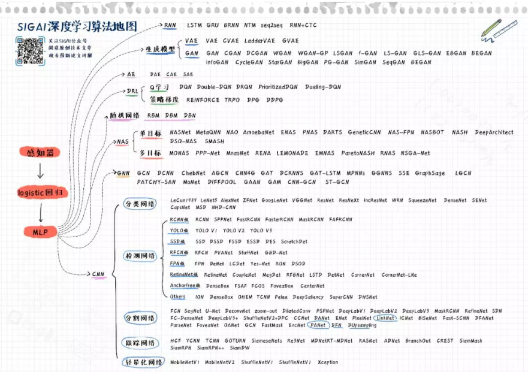

# Python2AI
从零开始学习人工智能，学习路线如下：
1. [重磅 | 完备的 AI 学习路线，最详细的资源整理！](https://mp.weixin.qq.com/s/uR99CyiU5fEdYlqdeu75uQ)
	- [重磅 | 完备的 AI 学习路线，最详细的资源整理！](https://mp.weixin.qq.com/s/fUNDdCzJrWBoKYh1tT4gSw)

## 1. Python
1. [1.2w 星！火爆 GitHub 的 Python 学习 100 天](https://mp.weixin.qq.com/s/5n_9E2ZSR8wC-I60RsQnJg) | [GitHub-Python-100-Days](https://github.com/jackfrued/Python-100-Days)
1. [伸手党的福音，6个Python练手项目](https://mp.weixin.qq.com/s/_4YgU53AHx7TksTFfbqakg)
	- GitHub-The-Flask-Mega-Tutorial [GitHub-中文](https://github.com/luhuisicnu/The-Flask-Mega-Tutorial-zh) | [英文原文地址](https://blog.miguelgrinberg.com/post/the-flask-mega-tutorial-part-i-hello-world)
	- Django 入门完全指南 [中文地址](https://github.com/pythonzhichan/django-beginners-guide) | [英文原文地址](https://simpleisbetterthancomplex.com/series/beginners-guide/1.11/)
	- [Flask Vue.js全栈开发教程系列](http://www.madmalls.com/blog/post/first-flask-test-restful-api/)

### 1.1 第一阶段 - Python基础学习(4月初-5月中旬)
5-7天自学掌握Python基础知识，然后进行Python基础知识测验。根据测试结果考虑是否重新学习Python基础知识。

1. 学习教材
    + [廖雪峰的官方网站-Python教程](https://www.liaoxuefeng.com/wiki/0014316089557264a6b348958f449949df42a6d3a2e542c000)
    + [莫烦PYTHON-Python 3 基础教程](https://morvanzhou.github.io/tutorials/python-basic/basic/)

>注：廖雪峰教材看累了，可以换着看看莫烦的Python视频。

2. Python基础阶段需要掌握知识点
	+ Python基础类型：数字类型、None类型、Bool类型、字符串类型
	+ Python常用内置数据结构：列表(list)、元组(tuple)、字典(dict)、集合(set)
	+ Python逻辑控制与操作：If分支语句、for/while循环控制、try...except异常处理
	+ Python函数：定义函数、函数参数、函数式编程
	+ Python类与模块：类构造、类实例化、模块介绍、模块加载和使用
	+ Python的IO编程：文件读写
	+ Python进程与线程：进程与线程区别

3. Python基础测验
完成上面的基础学习后，可以在下面的题目中小试牛刀：
    + [牛客网专项练习-编程语言Python](https://www.nowcoder.com/intelligentTest)
    + [GitHub-taizilongxu/interview_python](https://github.com/taizilongxu/interview_python)
    + [110到Python面试题](https://foofish.net/interview_summary.html)
    	> 110道题目pdf文件已经放到[Python_pdf](./Python_pdf)
    + [面试分享系列 | 17道Python面试题，让你在求职中无往不利](https://mp.weixin.qq.com/s/DzDcv1V8iBN9zEFCWQESlQ)
    + [分享 | 收集了60道硬核Python面试题](https://mp.weixin.qq.com/s/MAxtpZjxD6mJ7o_5TvEf4w)

### 1.2 第二阶段 - Python玩转算法(5月中旬-6月底)
30天左右时间掌握Python实现基础算法，然后完成[牛客网的《剑指Offer》](https://www.nowcoder.com/ta/coding-interviews)和[牛客网的LeetCode经典编程题](https://www.nowcoder.com/ta/leetcode)的练习。

算法刷题技巧：
1. [微信大佬总结的算法学习经验](https://mp.weixin.qq.com/s/fECqsr3T4WKNcx7s-2ozuA)

学习分三个部分:
1. 自己去 [牛客网的《剑指Offer》](https://www.nowcoder.com/ta/coding-interviews) 做题系统中进行python练习
	> 《剑指Offer》pdf书籍已经放到[algorithm](./algorithm)
2. 自己去 [牛客网的LeetCode经典编程题](https://www.nowcoder.com/ta/leetcode) 做题系统中进行python练习
3. 自己学习慕课网视频[《玩转算法面试 leetcode题库分门别类详细解析》](https://coding.imooc.com/class/82.html)

>在 [算法作业集](./problems.md) 中自主记录完成的习题并定时反馈结果, [算法作业集](./problems.md) 实现代码上传至 [solution_sample](./solution_sample) 文件夹中。

学习目标：
1. 需要掌握的题目类型：
	1. 数组
	2. 字符串
	3. 查找
	4. 排序
	5. 链表
	6. 堆栈
	7. 树+递归
	8. 回溯法
	9. 动态规划
	10. 贪心算法

2. 需要完成目标：
	1. 希望第二阶段结束后，可以把[牛客网的《剑指Offer》](https://www.nowcoder.com/ta/coding-interviews)全部刷完。
	2. 希望第二阶段结束后，可以把[牛客网的LeetCode经典编程题](https://www.nowcoder.com/ta/leetcode)全部刷完。

### 1.3 第三阶段 - Python进阶学习(5月中旬-5月底)
1天学习基于Python的经典库。14天完成一个Python爬虫工具。

1. 基于Python的经典库(1天了解经典库)
	1. Numpy
	 	- 这是一个非常有名的数据分析库。从计算数据分布的中位数，到处理多维数组，NumPy 都可以帮你完成。
	2. Pandas
		- 这是用来处理 CSV 文件的。当然了，你还需要处理一些表格、查看统计数据等，那 Pandas 就是可以满足你的需求的工具。
	3. Matplotlib
		- 把数据存储在 Pandas 的数据框后，你可能需要做一些可视化来理解数据的更多信息。毕竟一图抵千言。
	4. Seaborn
		- 这是另一个可视化工具，但这个工具更侧重于统计结果的可视化，比如直方图、饼图、曲线图或相关性表等。
	5. Scikit-Learn
		- 这是用 Python 实现机器学习的终极工具。所谓用 Python 实现机器学习指的就是这个——Scikit-Learn。所有你需要的从算法到提升的内容都能在这里找到。
	6. [干货|理解Python爬虫基础知识](https://mp.weixin.qq.com/s/AU1Awfs9v4r_umUf3FLpvA)

2. Python爬虫项目(14天)
	1. **1天完成练手项目** [3 个适合新人上手的Python项目（附代码！）](https://mp.weixin.qq.com/s/fqL-lIN5oRIyq394N0fuyw)
	2. **13天完成爬虫工具** 找一个感兴趣的爬虫项目练习
		- [GitHub 上有哪些优秀的 Python 爬虫项目？ - 知乎](https://www.zhihu.com/question/58151047)
		- [GitHub 上有哪些优秀的 Python 爬虫项目？ - 龙鹏-言有三的回答 - 知乎](https://www.zhihu.com/question/58151047/answer/640461600])

### 1.4 大牛阶段 - Python高级学习（选学）

1. Python高级用法
	1. Python对象的比较与复制
	2. 值传递、引用传递or其他，Python里参数是如何传递的？
	3. 强大的装饰器
	4. metaclass
	5. 深入理解迭代器和生成器
	6. 揭秘Python协程
	7. Python并发编程之future
	8. Python并发编程之asyncio
	9. 你真的懂Python GIL(全局解释器锁)吗？
	10. Python垃圾回收机制
	11. SWIG：TensorFlow等流行框架背后的Python/C++混合编程技术
	12. Python实现Web开发框架：Django、Flask

## 2. 机器学习(6月初-6月底)
**以下内容为了解内容，可以学习完整个机器学习内容后，再看：**
- [AI 算法工程师手册](http://www.huaxiaozhuan.com/)
- [Python机器学习课程（代码与教程）](https://mp.weixin.qq.com/s/YGlkx-VkA4pgkauaAGF-8g)
	1. [2000 星！绝佳的 Python 机器学习在线指南，教程 + 代码可能更适合你](https://mp.weixin.qq.com/s/0bVdcAsR0hI10Wgl9u0yrA)
- [机器学习算法地图](https://mp.weixin.qq.com/s/zAw3IhmwWf4b7hmdwS8XmQ)
- [GitHub-机器学习100天](https://github.com/MLEveryday/100-Days-Of-ML-Code)

>本阶段学习教材：书籍《统计学习方法》，李航著。[统计学习方法书籍pdf/算法Python代码实现/课件](./machinelearning/统计学习方法-电子书及代码实现-李航)

### 2.1 机器学习基础
1. 数据归一化方法
	- [机器学习-数据归一化方法（Normalization Method）](https://blog.csdn.net/program_developer/article/details/78637711)
1. 过拟合/欠拟合
1. 正则化
	- [机器学习中的L1和L2正则化项](https://blog.csdn.net/program_developer/article/details/79436657)
	- L-inifity Norm
1. 交叉验证
1. 模型评估
	- [【错误率、精度、查准率、查全率和F1度量】详细介绍](https://blog.csdn.net/program_developer/article/details/79937291)
	- [ROC曲线和AUC面积理解](https://blog.csdn.net/program_developer/article/details/79946787)
1. 偏差和方差
	- [机器学习中Bias（偏差）和Variance（方差）](https://blog.csdn.net/program_developer/article/details/79829034)
1. 数据不均衡处理方法
	- [处理不均衡数据（Dealing with imbalanced data）简洁版](https://blog.csdn.net/program_developer/article/details/80158057)
	- [分类中解决类别不平衡问题](https://blog.csdn.net/program_developer/article/details/80287033)
1. 优化算法
	- 梯度下降算法
	- 坐标下降法(Coordinate Descent)
	- 随机梯度下降法
	- 小批量梯度下降法

### 2.2 监督学习 
1. 线性模型
	- 参考资料汇总
		- [独家 | 为你介绍7种流行的线性回归收缩与选择方法（附代码）](https://mp.weixin.qq.com/s/6JberaY4H7it_UQiBls8wg)
		- [线性回归：这可能是机器学习中最简单的一个模型了](https://mp.weixin.qq.com/s/ulKyr7mvKvn7QHHVJPEzLg)
	1. 线性回归
		- 岭回归
		- Lasso回归
		- ElasticNet回归(弹性网络回归)
	2. 线性分类
		- 逻辑回归(会推导)
		- 最大似然
		- 多元逻辑回归模型
		- SoftMax回归

3. 支持向量机(会推导)
	1. Max-Margin的方法核心思想
	1. 线性SVM的一步步构建
	1. Slack Variable以及条件的松弛
	1. SVM的Dual Formulation
	1. Kernelized SVM
	1. 不同核函数的详解以及使用
	1. 核函数设计以及Mercer's Theorem
	1. Kernelized Linear Regression
	1. Kernelized PCA, Kernelized K-means

4. 决策树
	1. ID3
	1. C4.5 -> 随机森林 <- Bagging
	1. CART -> AdaBoost/GBDT <- Boosting
		- CART分类树
		- CART回归树
	1. 信息论

>决策树学习要与集成学习联系起来。 

5. 贝叶斯模型
	1. 朴素贝叶斯
	1. 贝叶斯网络
	1. 正态贝叶斯
	1. 主题模型（LDA) 以及生成过程
	1. Dirichlet Distribution, Multinomial Distribution
	1. 蒙特卡洛与MCMC(马尔可夫链蒙特卡罗算法)
	1. Metropolis Hasting与Gibbs Sampling
	1. 使用Collapsed Gibbs Sampler求解LDA
	1. Mean-field variational Inference
	1. 使用VI求解LDA
	1. Stochastic Optimization与Bayesian Inference
	1. 利用SLGD和SVI求解LDA
	1. 基于分布式计算的贝叶斯模型求解
	1. 随机过程与无参模型（non-parametric)
	1. Chinese Retarant Process
	1. Stick Breaking Process
	1. Stochastic Block Model与MMSB
	1. 基于SGLD与SVI的MMSB求解
	1. Bayesian Deep Learning模型
	1. Deep Generative Model

7. 浅层神经网络
8. KNN(k-Nearest Neighbor, k近邻学习)
	- [kNN 的花式用法](https://mp.weixin.qq.com/s/OQhbnSBnN3zlsvh84s1gJg)
	1. 距离度量学习
	1. Weighted KNN算法
	1. Approximated KNN算法
	1. KD树
	1. 近似KD树
	1. Locality	Sensitivity Hashing	(LSH, 局部敏感哈希)
9. LDA(线性判别分析) -> KLDA 
10. 隐马尔科夫模型
11. 条件随机场

### 2.3 无监督学习

#### 2.3.1 聚类
1. K-means聚类(会推导、会写代码)
	1. K-means++
1. 层次聚类算法
1. 高斯混合聚类
	1. 高斯混合模型
1. 密度聚类
	1. DBSCAN
1. OPTICS
1. Mean Shift
1. 谱聚类( Spectral Clustering)
1. EM算法以及收敛性
	1. 基于EM算法的参数估计
1. DCSCAN
1. 隐变量与隐变量模型
1. 隐马尔可夫模型(HMM)的应用以及参数
1. 条件独立、D-separation(D分离)
1. 基于Viterbi的Decoding
1. Forward/Backward算法
1. 有向图与无向图模型区别
1. Log-Linear Model
1. Feature Function的设计
1. Linear CRF以及参数估计

#### 2.3.2 降维
1. PCA -> KPCA
2. SVD
3. 流行学习
	1. LLE
	2. 拉普拉斯特征映射
	3. 等距映射
	4. 局部保持投影
4. 主题模型

### 2.4 集成学习
- [常用的模型集成方法介绍：bagging、boosting 、stacking](https://mp.weixin.qq.com/s/nwd4zXy6hTjt6Hx9e7QMFg)
- [从结构到性能，一文概述XGBoost、Light GBM和CatBoost的同与不同](https://mp.weixin.qq.com/s/2ZG6o0syQtkchIE4AANVWQ) | [机器之心](https://mp.weixin.qq.com/s/TD3RbdDidCrcL45oWpxNmw)
1. 集成模型的优势
1. Bagging
	1. 随机森林
	1. 完全随机森林
1. Boosting
	1. AdaBoost
	1. GBDT
	1. XGBoost
	1. LightGBM
	1. CatBoost
1. stacking
1. 基于残差的提升树训练思想
1. 集成不同类型的模型
1. VC理论

### 2.5 强化学习
- [从头开始强化学习](https://mp.weixin.qq.com/s/FUg9PLzd0qZWwUlWOU9JLw)
1. 策略迭代
1. 价值迭代
1. 蒙特卡罗算法
1. 时序差分算法
	1. SARSA算法
	1. Q学习
		- DQN
		- 策略梯度
1. Policy Learning
1. Deep RL

### 2.6 凸优化
1. 凸集、凸函数
1. 凸函数与判定凸函数
1. Linear/Quadratic/Integer Programming
1. 对偶理论，Duality Gap，KKT条件
1. Projected Gradient Descent
1. 迭代式算法的收敛分析

### 机器学习案例练习
1. 机器学习基础与凸优化案例
	1. 基于QP的股票投资组合策略设计
	1. 基于LP的短文本相似度计算
	1. 基于KNN的图像识别
1. SVM与集成模型案例
	1. 基于XGBoost的金融风控模型
	1. 基于PCA和Kernel SVM的人脸识别
	1. 基于Kernel PCA和Linear SVM的人脸识别
1. 无监督学习与序列模型
	1. 基于HMM和GMM的语音识别
	1. 基于聚类分析的用户群体分析
	1. 基于CRF的命名实体识别
1. 贝叶斯模型
	1. 基于Bayesian LSTM的文本分析
	1. 使用无参主题模型做文本分类
	1. 基于贝叶斯模型实现小数量的图像识别

## 3. 深度学习
- [深度学习算法地图](https://mp.weixin.qq.com/s/fRBdRo8eI1N_bUqh7k7I3A)

### 3.1 神经网络概述
1. 感知器
	- 感知器模型-神经网络的起点
1. logistic回归
	- logisitc回归虽然名字叫回归，但实际上是一种用于分类问题的算法，它在感知器模型的基础上加了一个logistic函数进行映射，得到区间(1, 0)类的概率值，刚好可以作为样本属于正样本的概率。logistic回归的作用类似于神经网络中的单个神经元，logistic函数即激活函数。这个函数导数的有界性为神经网络的梯度消失问题埋下了祸根。
1. MLP
	- 多层感知模型（MLP）-真正意义上的神经网络
1. 激活函数
1. BP算法

### 3.2 卷积神经网络
1. 基础知识
	1. 卷积层
	1. Pooling层
	1. 全连接层
	1. Dropout
	1. Bath Normalization
1. 分类网络
	1. AlexNet
	2. GoogleNet
	3. VGGNet
	4. ResNet
1. 检测网络
	1. RCNN簇
		- RCNN
		- SPPNet
		- FastRCNN
		- MaskRCNN
	2. YOLO簇
		- YOLO V1
		- YOLO V2
		- YOLO V3
	3. SSD簇
		- SSD
		- DSSD
	4. RFCN簇
	5. FPN簇
	6. RetinaNet簇
	7. Anchorfree簇
	8. 其它
1. 分割网络
	1. FCN
	2. DialatedConv
1. 跟踪网络
	1. HCF
1. 轻量化网络
	- MobileNet V1
	- MobileNet V2
	- ShuffleNet V1
	- Xception

### 3.3 循环神经网络
1. RNN与梯度消失
1. LSTM
1. GRU
1. BRNN
1. NTM
1. seq2seq
1. seq2seq+注意力机制
1. RNN+CTC
1. Word2Vec, Elmo, Bert, XLNet
1. 深度学习中的调参技术
1. 深度学习与图嵌入（Graph Embedding）
1. Translating Embedding (TransE)
1. Node2Vec
1. Graph Convolutional Network
1. Structured Deep Network Embedding
1. Dynamic Graph Embedding

### 3.4 生成式模型

#### 3.4.1 自回归模型：pixelRNN与pixelCNN
1. pixelRNN
1. pixelCNN

#### 3.4.2 VAE(Variational Auto-Encoder)
1. VAE
	+ [变分自编码器VAE：原来是这么一回事 | 附开源代码](https://zhuanlan.zhihu.com/p/34998569)
	+ Variational Autoencoder(VAE)与求解
1. CVAE
1. 隐变量的Disentangling
1. 图像的生成以及Disentangling
1. 文本的生成以及Disentangling

#### 3.4.3 GAN(Generative Adversial Network)
1. GAN
1. DCGAN
1. 层级结构的GAN
	- 使用多对GAN的模型有：StackGAN、GoGAN
	- 使用单一GAN，分阶段生成的有ProgressiveGAN
1. 自编码器结构的GAN
	- BEGAN
	- EBGAN
	- MAGAN
1. CGAN
1. CycleGan

### 3.5 GNN(图神经网络)
1. GCN

### 3.6 自编码器

### 深度学习优化方法
1. SGD
1. Adam
1. Adagrad

### 推荐系统与在线学习
1. 基于内容的推荐算法
1. 基于协同过滤的推荐算法
1. 矩阵分解
1. 基于内容的Gradient Tree
1. 基于深度学习的推荐算法
1. 冷启动问题的处理
1. Exploration vs Exploitation
1. Multi-armed Bandit
1. UCB1 algorithm，EXP3 algorithm
1. Adversarial Bandit model
1. Contexulalized Bandit
1. LinUCB

### 深度学习其它前言发展
1. 深度学习的可解释性
1. Deconvolution与图像特征的解释
1. Layer-wise Propagation
1. Adversial Machine Learning
1. Purturbation Analysis
1. Fair Learning

### 深度学习案例练习
1. 深度学习
	1. 基于Seq2Seq和注意力机制的机器翻译
	1. 基于TransE和GCN的知识图谱推理
	1. 基于CNN的人脸关键点检测
1. 推荐系统与在线学习
	1. 使用Gradient Boosting Tree做基于 interaction 与 content的广告推荐
	1. 使用深度神经网络做基于interaction 与 content的推荐
	1. LinUCB做新闻推荐, 最大化rewards
1. 生成式模型
	1. 基于GAN的图像生成
	1. 基于VAE的文本Style Transfer
1. 深度学习其它前言发展
	1. 可视化机器翻译系统

## 读论文方法
1. 读一篇论文要带着四个问题读：
	- 要解决什么问题？
	- 用了什么方法解决？
	- 效果如何？
	- 还存在什么问题？
1. [Andrew Ng关于机器学习职业生涯以及阅读论文的一些建议](https://mp.weixin.qq.com/s/faiksNxyXRCV8pzKsv9LpA)

